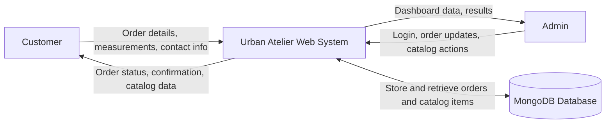
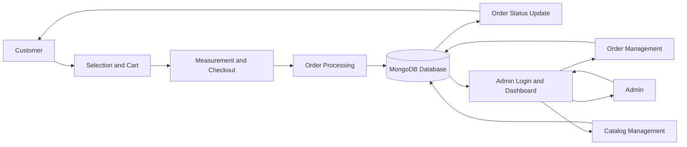

# Appendices

## Data Flow Diagram

The data flow diagram shows how the customer, admin, and database interact with the Urban Atelier system.



The detailed flow breaks the system into smaller steps such as selection, checkout, order processing, status updates, login, order management, and catalog management.



## Database Table Structure

The database structure is shown in the image below for a cleaner report layout.


## API Reference

### Authentication

- `POST /api/admin/login` returns a JWT token for admin access.

### Order APIs

- `POST /api/orders` creates a new order.
- `GET /api/orders` lists all orders.
- `GET /api/orders/statuses?ids=id1,id2` fetches selected order statuses.
- `PATCH /api/orders/:id/complete` marks an order as completed.
- `DELETE /api/orders/:id` deletes one order.
- `DELETE /api/orders` deletes all orders.

### Catalog APIs

- `GET /api/catalog?type=clothing` lists clothing items.
- `GET /api/catalog?type=fabric` lists fabric items.
- `POST /api/catalog` creates a catalog item.
- `DELETE /api/catalog/:id` deletes a catalog item.

## Code Snippets

### Admin Login Flow

```javascript
async function handleLogin(event) {
  event.preventDefault();
  const username = document.getElementById("username").value.trim();
  const password = document.getElementById("password").value.trim();

  const payload = await apiRequest("/admin/login", {
    method: "POST",
    body: JSON.stringify({ username, password }),
  });

  sessionStorage.setItem("adminLoggedIn", "true");
  sessionStorage.setItem("adminToken", payload.token);
}
```

### Catalog Item Creation

```javascript
exports.createCatalogItem = async (req, res) => {
  const createdItem = await CatalogItem.create({
    type,
    name,
    image,
  });

  return res.status(201).json({
    id: String(createdItem._id),
    type: createdItem.type,
    name: createdItem.name || "",
    image: createdItem.image,
  });
};
```

### Storefront Catalog Loading

```javascript
async function loadCatalogItemsFromApi() {
  const [clothingItems, fabricItems] = await Promise.all([
    apiRequest("/catalog?type=clothing"),
    apiRequest("/catalog?type=fabric"),
  ]);
}
```

## Screenshots

Insert screenshots here in the final Word/PDF version.

Suggested screenshots:

1. Home page
2. Clothing selection section
3. Fabric selection section
4. Confirmation modal
5. Cart page
6. Measurement form
7. Order submission page
8. Customer orders page
9. Admin login page
10. Admin dashboard
11. Add-items page
12. Catalog upload result
13. Catalog deletion result
14. MongoDB collection view
15. API test / health endpoint

Page-count guidance for final formatting:

- Keep each major screenshot on a separate figure block with caption and short explanation.
- Add at least 20-25 screenshots across customer flow, admin flow, API checks, and database views.
- Keep code snippets and database tables on separate pages where needed.
- With 12 pt font, 1.5 spacing, and these figures, the document will stay at the indexed page count or higher.
