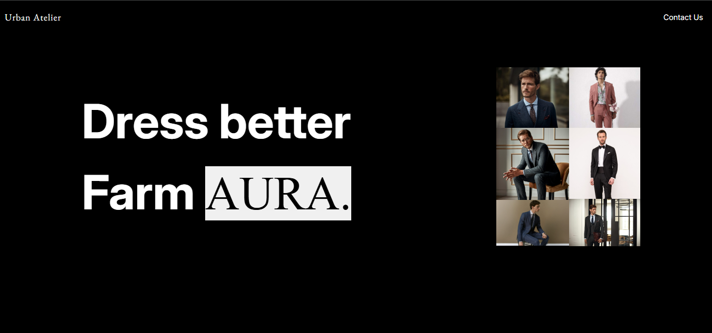
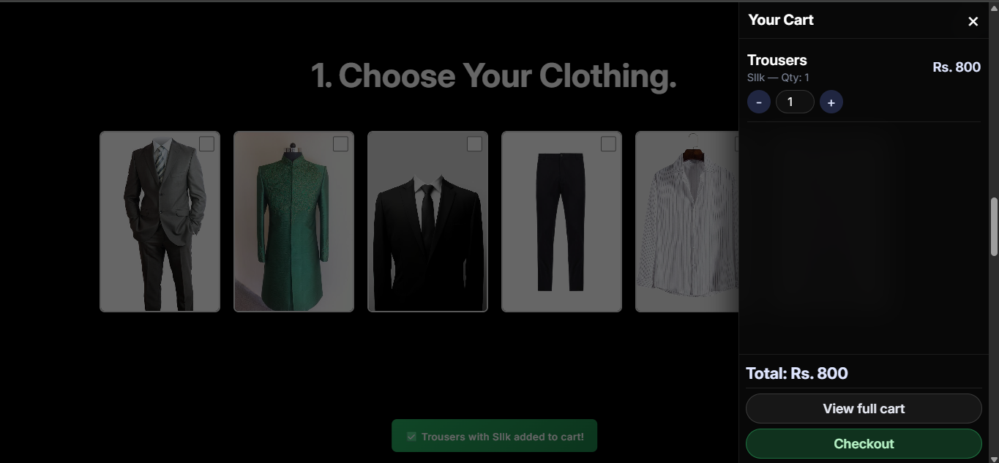
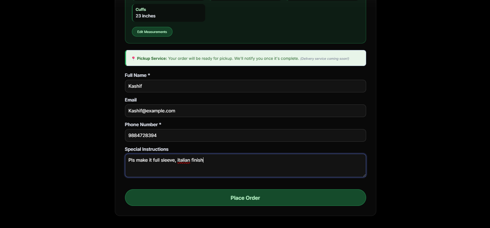
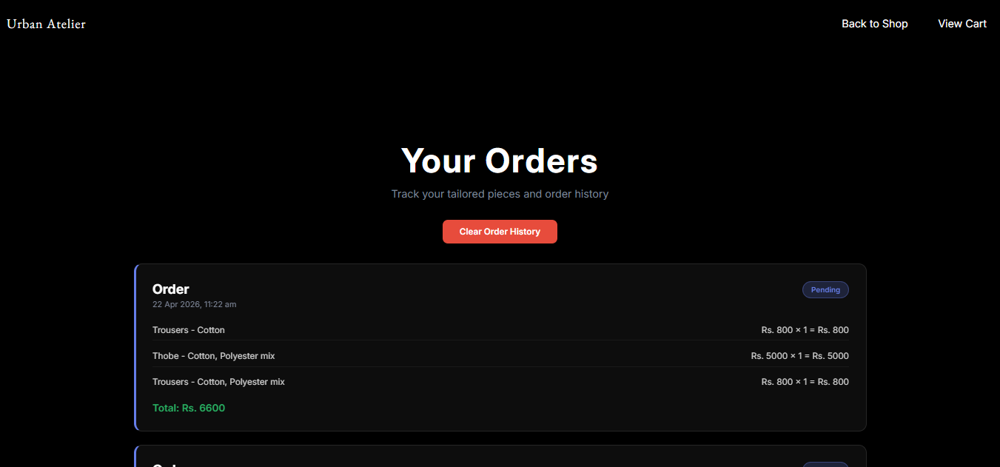
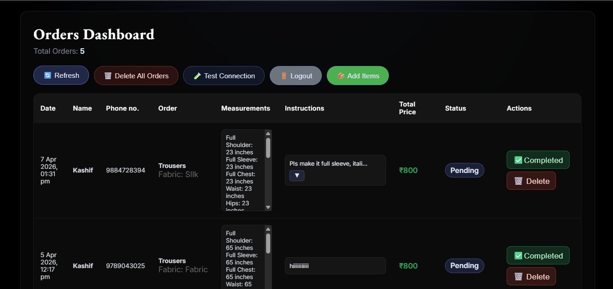
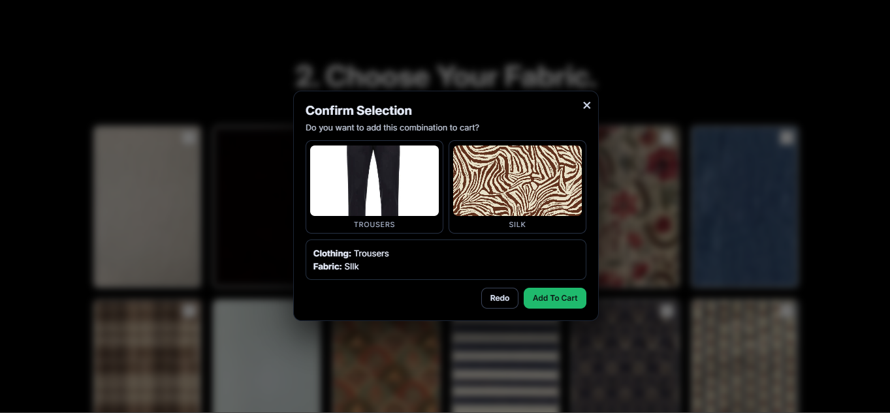

# Urban Atelier Tailor App

Simple full-stack tailor ordering app.

- Frontend: static HTML/CSS/JS (project root)
- Backend: Node.js + Express (`my-node-express-mongodb-app`)
- Database: MongoDB Atlas

## Quick Start

1. Install backend dependencies:

```bash
npm run install:backend
```

2. Create backend `.env` in `my-node-express-mongodb-app`:

```env
PORT=3001
MONGODB_URI=your-mongodb-uri
ADMIN_USERNAME=your-admin-username
ADMIN_PASSWORD_HASH=your-bcrypt-hash
JWT_SECRET=your-long-random-secret
```

3. Run from project root:

```bash
npm start
```

4. Open:

- App: http://localhost:3001
- Health: http://localhost:3001/api/health

## Main Pages

- `/` - customer storefront
- `/cart.html` - cart + measurements
- `/order.html` - checkout
- `/yorders.html` - customer order history
- `/admin.html` - admin login + orders dashboard
- `/add-items.html` - catalog management

## API (core)

- `GET /api/health`
- `POST /api/orders`
- `GET /api/orders`
- `PATCH /api/orders/:id/complete`
- `DELETE /api/orders/:id`
- `DELETE /api/orders`
- `POST /api/admin/login`

## Screenshots

These images are shown directly on the repository homepage through this root README.

### Storefront



### Cart and Checkout




### Orders



### Admin




## Screenshot File Names

Put screenshots in `docs/screenshots/` using these names:

- `home-page.png`
- `cart-page.png`
- `checkout-page.png`
- `admin-dashboard.png`
- `add-items-page.png`
- `your-orders-page.png`
- `admin-login.png`

## Notes

- Orders persist in MongoDB Atlas.
- Cart/temp data is in browser localStorage.
- Never commit `.env`.
